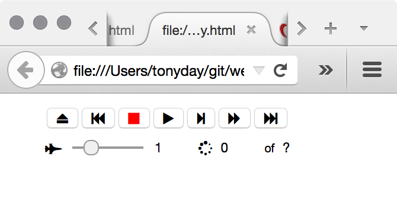

<h1 align="center">
    <a href="https://github.com/tonyday567/web-play">
        Web-Play
    </a>
</h1>

<hr>

web-play is a repo containing a bunch of code that makes this in haskell:



The libray requires a bespoke version of the mvc library which can be found in the [mvc - dev branch][]. It also requires [lucid-page][], [mvc-extended][], [time-extended][] and [pipes-extended][].

``` sh
$ git clone https://github.com/tonyday567/lucid-page.git
$ git clone https://github.com/tonyday567/mvc-extended.git
$ git clone https://github.com/tonyday567/time-extended.git
$ git clone https://github.com/tonyday567/pipes-extended.git
$ git clone https://github.com/tonyday567/Haskell-MVC-Library.git
$ cd Haskell-MVC-Library && git checkout dev && cd ..
$ git clone https://github.com/tonyday567/web.play.git
$ cd web.play
$ cabal sandbox init
$ cabal sandbox add-source ../lucid-page
$ cabal sandbox add-source ../mvc-extended
$ cabal sandbox add-source ../time-extended
$ cabal sandbox add-source ../pipes-extended
$ cabal sandbox add-source ../Haskell-MVC-Library
$ cabal configure --enable-tests
$ cabal install --dependencies-only --dry-run
$ cabal install --dependencies-only
$ cabal build
$ dist/build/test/test
```

[mvc - dev branch]: https://github.com/tonyday567/Haskell-MVC-Library/tree/dev
[lucid-page]: https://github.com/tonyday567/lucid-page
[mvc-extended]: https://github.com/tonyday567/mvc-extended
[time-extended]: https://github.com/tonyday567/time-extended
[pipes-extended]: https://github.com/tonyday567/pipes-extended
